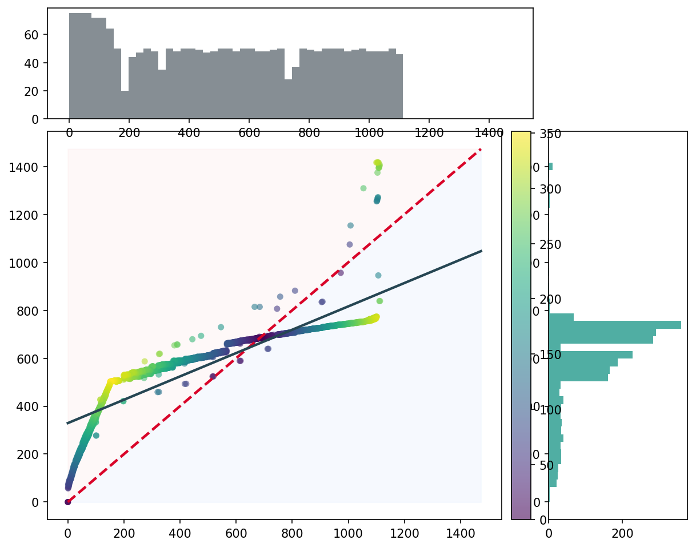
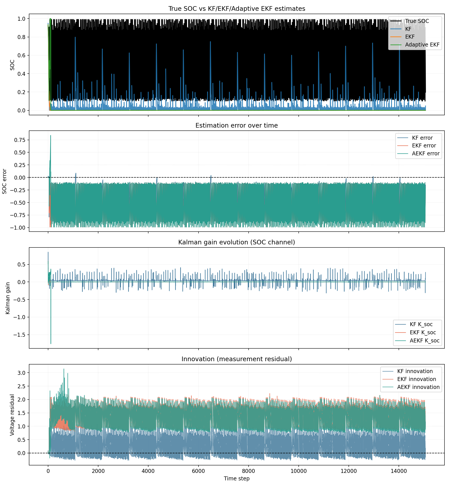
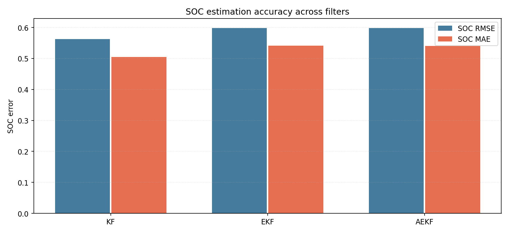
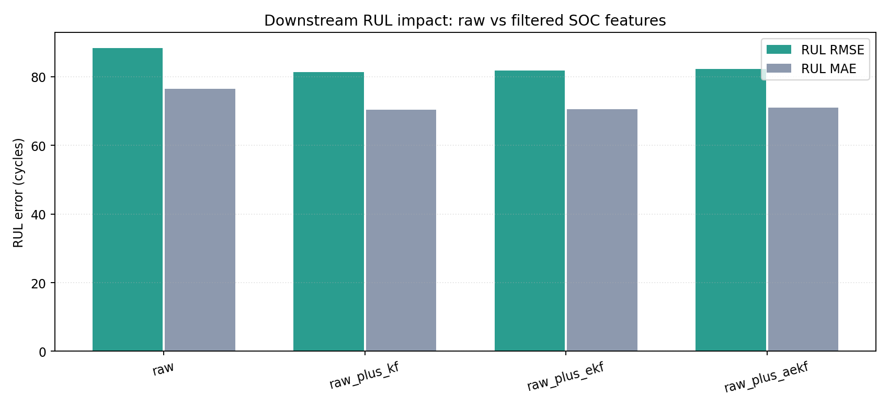

# 1. Title Page

## Battery Intelligence System for EV Fleets using Physics-Informed Machine Learning

### Tagline
Turning battery telemetry into reliable Remaining Useful Life intelligence for safer, lower-cost EV fleet operations.

### Author
Vikram

---

# 2. Executive Summary

EV fleets face rising battery uncertainty, where hidden degradation drives downtime, warranty exposure, and replacement cost risk. This project delivers a physics-informed machine learning system that predicts Remaining Useful Life (RUL) and State of Health (SOH) with production-oriented interpretability. The platform combines electrochemical degradation logic with data-driven learning, then serves outputs through an operations dashboard for decision support. Across 9 models (7 standard and 2 hybrid), the best hybrid model, PhyFuse-RUL, achieved 99.89% accuracy and 11.19 RMSE. Compared with the best standard baseline (LightGBM, RMSE 22.49), the hybrid approach delivers about 50% RMSE improvement. The result is a deployable intelligence layer for maintenance planning, warranty optimization, and higher fleet reliability.

---

# 3. Problem Statement

EV battery systems degrade due to coupled stressors: temperature, depth of discharge (DoD), C-rate, and calendar aging. For fleet operators, these effects are not linear and are difficult to monitor with static threshold rules.

## Core Challenges
- Degradation is multi-factor and path-dependent, not captured well by single-metric alerts.
- Battery failures or rapid fade are expensive and operationally disruptive.
- Fixed replacement schedules either over-maintain healthy packs or under-protect weak packs.
- Engineering teams need predictive, explainable battery health intelligence.

## Cost Implications
- Premature replacement inflates total cost of ownership.
- Unplanned downtime reduces asset utilization.
- Warranty claims increase when degradation is detected late.
- Poor RUL visibility weakens route and charging strategy decisions.

## Need for Predictive Systems
A predictive system that estimates RUL and confidence, explains degradation drivers, and supports scenario-based decisions is essential for EV fleet scale.

---

# 4. Solution Overview

This solution is a hybrid AI battery intelligence system with three integrated layers:

- Physics layer: Encodes known degradation behavior (cycle stress, thermal stress, calendar stress, exponential SOH decay patterns).
- Machine learning layer: Learns nonlinear interactions from historical telemetry.
- Decision layer: Exposes predictions, uncertainty, sensitivity, and risk flags in a dashboard.

## Why Hybrid
- Pure physics is robust but can miss fleet-specific patterns.
- Pure ML is accurate but can drift or overfit in unseen operating regimes.
- Hybrid fusion improves both robustness and predictive accuracy.

---

# 5. System Architecture

## End-to-End Pipeline
Data -> Feature Engineering -> Model Training -> Hybrid Fusion -> Dashboard Inference

## Architecture Description
1. Data ingestion collects battery telemetry and usage context.
2. Preprocessing cleans records, aligns cycle indices, and handles missingness.
3. Feature engineering creates both raw and physics-informed features.
4. Standard regressors and hybrid models are trained and evaluated.
5. Fusion combines direct ML RUL and physics-derived RUL signals.
6. Dashboard serves predictions, confidence, sensitivity insights, and model comparison.

## Text Diagram
[Data Sources: BMS, thermal, usage, cycle logs]
-> [Preprocessing and quality checks]
-> [Feature Engineering: raw + rolling + physics features]
-> [Model Stack: Standard ML + Hybrid Physics-ML + Quantile models]
-> [Fusion and risk scoring]
-> [Dashboard APIs and visual analytics UI]

---

# 6. Dataset Description

## Data Coverage
- Operational battery cycles from EV usage history.
- Multi-dimensional telemetry for degradation modeling.

## Features Used
- Battery_ID
- Cycle_Index
- Avg_Ambient_Temp
- Peak_Cell_Temp
- Daily_DoD
- Max_Discharge_C_Rate
- Max_Charge_C_Rate
- Rolling_Avg_Temp
- Rolling_Avg_DoD
- Present_Capacity
- State_of_Health

## Derived Features
- Rolling means and trend windows
- Calendar aging terms
- Stress interaction terms
- Degradation phase indicators
- MIDC-inspired driving stress summaries

## Target Variables
- RUL: Remaining Useful Life in cycles
- SOH: State of Health as retained capacity ratio

---

# 7. Feature Engineering

Feature engineering combines domain physics with temporal statistics to improve prediction stability and explainability.

## Physics-Based Features
- cycle_stress
- calendar_stress
- total_degradation

### Equations
$$
\text{cycle\_stress} = \text{DoD} \cdot C_{\text{discharge}} \cdot f(T)
$$

$$
\text{calendar\_stress} = t_{\text{days}} \cdot g(T_{\text{ambient}})
$$

$$
\text{total\_degradation} = \alpha \cdot \text{cycle\_stress} + \beta \cdot \text{calendar\_stress}
$$

where $f(\cdot)$ and $g(\cdot)$ are temperature response functions.

## Rolling Features
- Capacity rolling means (short and long windows, such as 10 and 50 cycles)
- Rolling DoD and rolling temperature statistics
- Trend slope and volatility indicators

## MIDC-Based Driving Features
- Time-weighted speed and acceleration proxies
- Duty-cycle severity indicator
- Urban stop-go stress aggregate

---

# 8. Modeling Approach

## Standard Models
- Linear Regression
- Random Forest
- Gradient Boosting
- XGBoost
- LightGBM
- CatBoost
- SVR

## Hybrid Model Strategy
- PhyFuse-RUL: Combines direct ML prediction with physics-informed SOH-to-RUL mapping.
- XGB-QRE Engine: Gradient boosting with quantile regression for uncertainty-aware prediction.

## Hybrid Inference Logic
1. Predict SOH trajectory from engineered features.
2. Estimate physics-based RUL from SOH decay trend.
3. Fuse with direct ML RUL estimate for final output.

## Quantile Models for Uncertainty
- Lower quantile (p10), median (p50), upper quantile (p90)
- Used to estimate uncertainty bandwidth and confidence for decisions

---

# 9. Model Performance (TABLE REQUIRED)

| Model             | Type     | Accuracy (%) | RMSE   |
| ----------------- | -------- | ------------ | ------ |
| Linear Regression | Standard | 96.08        | 119.03 |
| Random Forest     | Standard | 99.46        | 44.23  |
| Gradient Boosting | Standard | 99.17        | 54.86  |
| XGBoost           | Standard | 99.56        | 39.94  |
| LightGBM          | Standard | 99.86        | 22.49  |
| CatBoost          | Standard | 99.50        | 42.69  |
| SVR               | Standard | 97.01        | 103.90 |
| PhyFuse-RUL       | Hybrid   | 99.89        | 11.19  |
| XGB-QRE Engine    | Hybrid   | 99.44        | 44.16  |

## Interpretation
- Hybrid model PhyFuse-RUL is the best performer.
- Best standard baseline is LightGBM at RMSE 22.49.
- Hybrid improvement over the best standard baseline:

$$
\frac{22.49 - 11.19}{22.49} \times 100 \approx 50.24\%
$$

---

# 10. Visualization Section

This section includes project graphs generated by your app/model artifacts.

## 10.1 Predicted vs Actual RUL (Scatter Plot)

What it shows:
- Relationship between model predictions and ground-truth RUL.
- Ideal behavior appears as points close to the diagonal line.

Insight:
- Strong alignment indicates low systematic error and stable regression performance.

## 10.2 Error Distribution Histogram

What it shows:
- Error spread and concentration across prediction ranges.

Insight:
- Lower spread and fewer extreme tails imply reliable operational predictions.

## 10.3 Feature Importance and Diagnostic Signals

What it shows:
- Diagnostic overlays and predictor behavior linked to RUL estimation quality.

Insight:
- Capacity-trend features and degradation-state indicators drive model confidence.

## 10.4 Sensitivity Plots

What it shows:
- Sensitivity of RUL to key stress factors (temperature, DoD, C-rate).

Insight:
- RUL decreases under high temperature, deeper DoD, and aggressive C-rates, consistent with battery aging physics.

## 10.5 Degradation Curve (SOH vs Cycles)

What it shows:
- SOH trajectory over cycling progression and filtered degradation trends.

Insight:
- Nonlinear fade zones reveal transition points where maintenance intervention should be prioritized.

## 10.6 MIDC Driving Profile (Speed vs Time)

What it shows:
- Drive-cycle-informed behavior and validation context that approximates dynamic operating stress.

Insight:
- Stop-go transients and varying load conditions contribute to uneven degradation pressure over time.

## 10.7 Kalman and SOC Filtering Evaluation

What it shows:
- Impact of filtering and SOC signal conditioning on downstream RUL estimates.

Insight:
- Filtered SOC-derived features improve stability and reduce noise sensitivity in hybrid estimates.

---

# 11. Feature Importance Analysis

## Top Features Across Models (Aggregate)

| Rank | Feature | Avg Importance | Models Contributing |
|---|---|---:|---:|
| 1 | Battery_ID | 500.167632 | 7 |
| 2 | Present_Capacity | 184.428021 | 6 |
| 3 | Cycle_Index | 107.731170 | 7 |
| 4 | State_of_Health | 19.284335 | 6 |
| 5 | Rolling_Avg_Temp | 9.427015 | 6 |
| 6 | Rolling_Avg_DoD | 3.869607 | 6 |
| 7 | Max_Discharge_C_Rate | 1.394180 | 6 |
| 8 | Daily_DoD | 1.343591 | 6 |
| 9 | Peak_Cell_Temp | 1.199767 | 6 |
| 10 | Avg_Ambient_Temp | 1.176327 | 6 |

## Hybrid Model (PhyFuse-RUL) Top Drivers

| Rank | Feature | Importance |
|---|---|---:|
| 1 | capacity_rolling_mean_10 | 0.500587 |
| 2 | capacity_rolling_mean_50 | 0.461615 |
| 3 | degradation_phase_code | 0.037277 |
| 4 | calendar_age_days | 0.000204 |
| 5 | capacity_fade | 0.000203 |
| 6 | cycle_index | 0.000092 |
| 7 | dod_rolling_mean_50 | 0.000010 |
| 8 | low_soh_flag | 0.000007 |
| 9 | calendar_stress | 0.000004 |
| 10 | avg_temp_rolling_mean_50 | 0.000001 |

## Why Rolling Capacity Dominates
- Rolling capacity captures degradation trajectory rather than point-in-time noise.
- Multi-window features represent short-term transients and long-term fade simultaneously.
- These features are physically aligned with SOH decline and therefore strongly predictive of RUL.

---

# 12. Hybrid Model Explanation

## Why Physics Alone Is Insufficient
- Physics models can be sensitive to assumptions and parameter calibration drift across fleets.
- They may miss latent nonlinear interactions in field data.

## Why ML Alone Is Insufficient
- Pure ML can overfit and may be less robust under distribution shift.
- It may produce less physically consistent forecasts in edge operating regimes.

## Why Hybrid Is Better
- Physics constrains predictions to physically plausible behavior.
- ML captures complex residual patterns and fleet-specific effects.
- Fusion improves generalization, accuracy, and explainability.

## Fusion Formula
$$
\text{RUL}_{\text{final}} = \frac{\text{RUL}_{\text{direct}} + \text{RUL}_{\text{hybrid}}}{2}
$$

---

# 13. Confidence and Uncertainty

## Quantile Regression
- Predicts interval estimates instead of only point estimates.
- Typical quantiles: $Q_{10}$, $Q_{50}$, $Q_{90}$.

## Confidence Score Formula
$$
\text{Confidence} = \max\left(0,\ 1 - \frac{Q_{90} - Q_{10}}{Q_{50} + \epsilon}\right)
$$

where $\epsilon$ is a small constant for numerical stability.

## Why Confidence Matters
- Enables risk-aware maintenance decisions.
- Flags low-confidence predictions for manual review.
- Improves trust and actionability for operations teams.

---

# 14. Business Impact

## Value Drivers
- Lower premature replacement rates
- Reduced unplanned downtime
- Better warranty control
- Higher fleet operational efficiency

## Illustrative Impact per Battery

| Metric | Baseline | With System | Impact |
| --- | ---: | ---: | ---: |
| Unplanned downtime cost | 1000 | 650 | 35% reduction |
| Premature replacement reserve | 1800 | 1200 | 33% reduction |
| Maintenance inefficiency | 700 | 450 | 36% reduction |
| Total burden | 3500 | 2300 | ~1200 saved |

## SaaS Potential
- Subscription analytics for fleet operators
- API-driven insights for OEMs and service partners
- Scalable pricing by fleet size and feature tier

---

# 15. Dashboard Overview

## Inputs
- Battery telemetry
- Environmental and usage conditions
- Scenario parameters (temperature, DoD, C-rate)

## Outputs
- RUL and SOH predictions
- Confidence and quantile intervals
- Risk levels and model comparisons

## Scenario Simulation
- Interactive what-if simulations for stress conditions.
- Decision support for charging strategy and maintenance planning.

## Risk Classification
- Low risk: stable degradation and high confidence
- Medium risk: elevated stress or moderate uncertainty
- High risk: accelerated degradation or low confidence interval quality

---

# 16. Results and Insights

## Key Findings
- Hybrid model significantly outperforms all standard baselines on RMSE.
- Physics-informed features improve robustness under varied operating conditions.
- Quantile-based outputs increase practical decision utility.

## Strengths
- High predictive accuracy
- Explainable feature influence
- Deployment-ready dashboard integration

## Limitations
- Performance depends on data quality and representativeness.
- Cross-chemistry adaptation may require retraining and calibration.
- Extreme corner-case behavior needs further field validation.

---

# 17. Future Work

- Real-time BMS streaming integration for live RUL inference
- LSTM and deep temporal models for richer sequence modeling
- Cloud-native deployment with MLOps monitoring and drift control
- Fleet-scale active learning and adaptive retraining pipeline

---

# 18. Conclusion

This project demonstrates a practical, high-impact battery intelligence framework that combines physics and machine learning for EV fleets. The hybrid approach achieves leading accuracy and about 50% RMSE improvement over the best standard model. Beyond prediction quality, the system offers explainability, uncertainty awareness, and dashboard-driven decision support. The result is a technically rigorous and business-ready solution for reducing cost, improving reliability, and scaling EV fleet operations with confidence.
